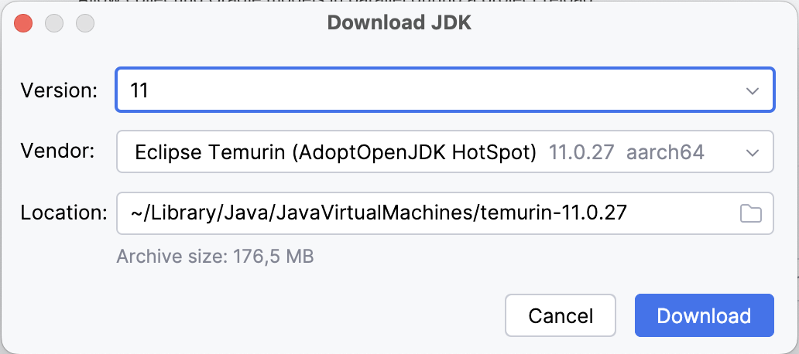

<p align="center">
  <a href="https://github.com/EnAccess/micropowermanager-agent-app">
    
  </a>
</p>
<p align="center">
    <em>Decentralized utility management made simple. Manage customers, revenues and assets with this all-in one open source platform.</em>
</p>
<p align="center">
  
  
  <a href="https://github.com/EnAccess/micropowermanager-agent-app/blob/main/LICENSE" target="_blank">
    
  </a>
  
  
</p>

---

# MicroPowerManager - Agent App

MicroPowerManager (MPM) is a decentralized utility and customer management tool designed for energy access providers.

This repository contains the source code for the [MicroPowerManager Agent App](https://micropowermanager.io/usage-guide/android-apps.html).
This Android application enables agents to manage customers, track payments, monitor appliances, and handle support tickets efficiently.

## 🚀 Features

- **📊 Dashboard**: Real-time business analytics with summary and graph views
- **👥 Customer Management**: Comprehensive customer database with detailed profiles
- **💰 Payment Tracking**: Payment collection, history, and revenue analytics
- **🔌 Appliance Management**: Track sold appliances and their status
- **🎫 Support Tickets**: Create and manage customer support requests
- **🔐 Secure Authentication**: Protected login system with session management
- **📱 Push Notifications**: Real-time updates via Firebase Cloud Messaging

## 📚 Technology Stack

- **Language**: Kotlin 1.6.21
- **Minimum SDK**: API 21 (Android 5.0)
- **Target SDK**: API 31 (Android 12)
- **Architecture**: MVVM with Repository pattern
- **Dependency Injection**: Koin
- **Networking**: Retrofit + RxJava
- **Navigation**: Android Navigation Component
- **UI**: Material Design + ViewBinding
- **Build System**: Gradle with Kotlin DSL
- **Push Notifications**: Firebase Cloud Messaging
- **Crash Reporting**: Firebase Crashlytics

## 🛠️ Development

### 📋 Prerequisites

Before you begin, ensure you have the following installed:

- [Android Studio](https://developer.android.com/studio) (latest version recommended)
- [Git](https://git-scm.com/) for version control
- [Java Development Kit (JDK) 11](https://adoptium.net/) - Eclipse Temurin recommended
- (Optional) [direnv](https://direnv.net/) for environment management

### 🤖 Prepare local environment for development

1. Clone the Repository

   ```bash
   git clone https://github.com/EnAccess/micropowermanager-agent-app.git
   cd micropowermanager-agent-app
   ```

2. Configure Android Studio

   1. **Open the project** in Android Studio
   2. **Configure Gradle JDK**:

      - Go to **Android Studio > Settings > Build, Execution, Deployment > Build Tools > Gradle**
      - Set **Gradle JDK** to `temurin-11`
      - If not installed, select **Download JDK...** and choose:
        - **Version**: `11`
        - **Vendor**: `Eclipse Temurin AdoptOpenJDK HotSpot`
        - **Location**: `<default>`

      

      > **Note**: For optimal performance on Mac with M-chips, select `aarch64` architecture.

3. **Environment Setup** (Optional but recommended):

   ```bash
   cp .envrc.sample .envrc
   # Edit .envrc and set JAVA_HOME to match your Gradle JDK path
   ```

4. **Sync Project**: Click **Sync Project with Gradle files**

### 🚀 Build and run the app locally

**On Device/Emulator:**

- Minimum requirement: Android 5.0 (API 21)
- Ensure **Google Play Services** is installed (required for location features)
- Configure location services for full functionality

**Build Variants:**

- **Debug**: Development build with debugging enabled
- **Release**: Production build with code optimization and signing

## 📦 Building

### Debug Build

```bash
./gradlew assembleDebug
```

### Release Build

```bash
./gradlew assembleRelease
```

The output APK will be located at `app/build/outputs/apk/release/`

### Build Configuration

The app uses the following build configuration:

- **Code Optimization**: Enabled for release builds
- **Resource Shrinking**: Enabled for release builds
- **ProGuard**: Configured for code obfuscation
- **Signing**: Release builds are signed with a keystore

## 🏗️ Architecture

This application follows a **multi-module architecture** with clear separation of concerns:

### Core Modules

- **`core`**: Base utilities, constants, and shared components
- **`core_ui`**: Common UI components and base classes
- **`core_network`**: Network layer with Retrofit and RxJava
- **`core_network_auth`**: Authenticated API endpoints
- **`core_network_no_auth`**: Public API endpoints
- **`core_localization`**: String resources and localization

### Feature Modules

- **`feature_login`**: Authentication and user session management
- **`feature_main`**: Main navigation and drawer functionality
- **`feature_dashboard`**: Business analytics and reporting
- **`feature_customers`**: Customer management system
- **`feature_payment`**: Payment processing and tracking
- **`feature_appliance`**: Appliance inventory management
- **`feature_ticket`**: Support ticket system

### Shared Modules

- **`shared_navigation`**: Navigation coordination between features
- **`shared_agent`**: Agent-specific functionality
- **`shared_customer`**: Customer data models and utilities
- **`shared_messaging`**: Push notification handling
- **`shared_success`**: Success state management

### Main Activities

- **SplashActivity**: Initial loading screen and navigation logic
- **LoginActivity**: User authentication
- **MainActivity**: Main application interface with navigation drawer

### Dependencies

The project uses several key dependencies:

- **Koin**: Dependency injection
- **Retrofit**: Network requests
- **RxJava**: Reactive programming
- **Navigation Component**: Screen navigation
- **Material Design**: UI components
- **Firebase**: Push notifications and crash reporting

## 👥 Contributing

### Adding New Features

1. Create a new feature module following the existing pattern
2. Implement MVVM architecture with Repository pattern
3. Add proper dependency injection with Koin
4. Include unit tests for business logic
5. Update navigation if needed
